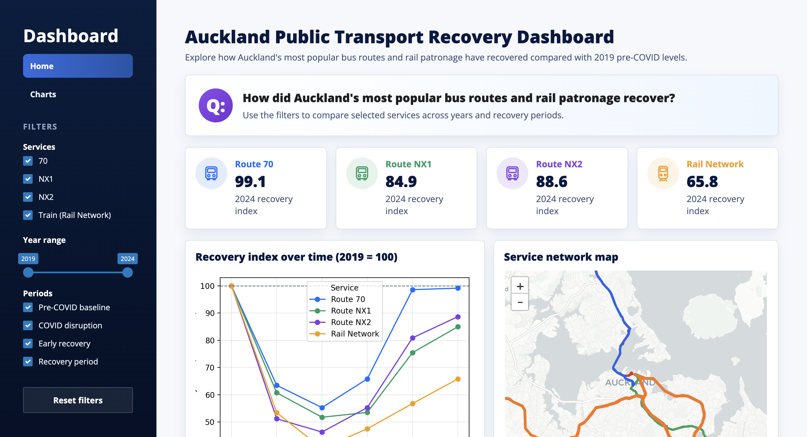
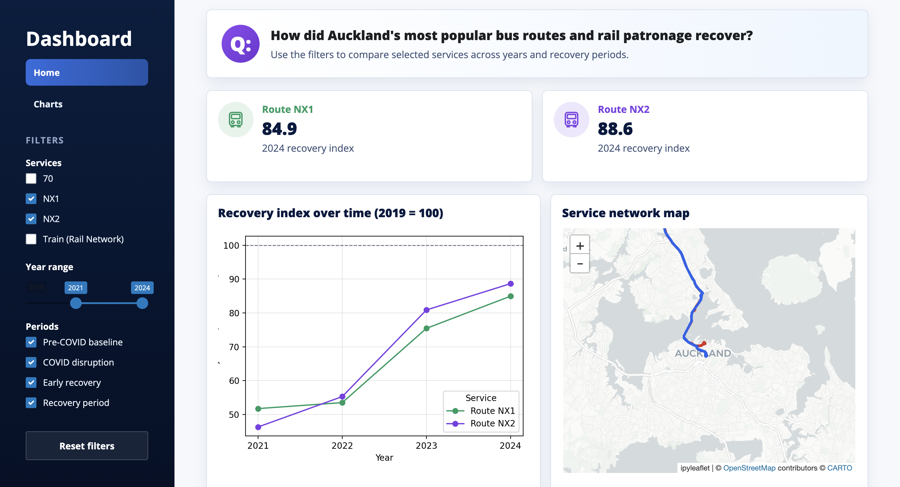
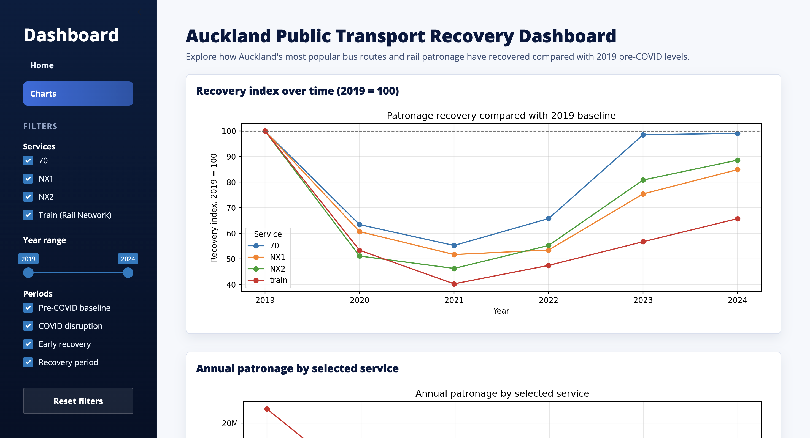

## Motivation and Audience

This dashboard addresses the question: **How did Auckland’s most popular bus routes and rail patronage recover compared with 2019 pre-COVID levels?** It focuses on routes 70, NX1, NX2, and the rail network, using a recovery index where 2019 = 100.

The dashboard is intended for transport planners, students, local government staff, or anyone interested in Auckland public transport recovery. It helps users compare which services recovered more strongly, which remain below 2019 levels, and how bus routes differ from the wider rail network.

This dashboard helps show how Auckland’s key public transport services recovered after the disruption caused by COVID. By comparing routes 70, NX1, NX2, and the rail network against their 2019 pre-COVID patronage levels, users can see which services returned closest to normal and which remained below their previous levels. This provides insight into how travel behaviour changed over time and whether major bus routes and rail services recovered at the same pace.

## Data and Preparation

### Datasets used
This dashboard uses annual patronage data from 2019 to 2024 for routes 70, NX1, NX2, and the rail network. The bus routes' data are derived from Auckland Transport's bus performance reports, while the rail data is derived from Auckland Transport monthly patronage data summed into yearly totals.

### Cleaning and preparation steps
The patronage table was prepared using Excel as a clean CSV with one row per service and the columns being years 2019 to 2024. Using Python, the data was reshaped from wide to long format, converted to numeric values, and used to calculate recovery_index and change_from_2019_pct. Years were also grouped into periods: pre-COVID baseline, COVID disruption, early recovery, and recovery period.

Spatial data is loaded from bus_routes.geojson and train_routes.geojson. Both are reprojected to EPSG:4326 for ipyleaflet, and route numbers are cleaned so selected services can be matched to their map features.

### Limitations
A key limitation is that bus values are individual routes, while rail represents the whole train network, so raw patronage cannot be directly compared. The analysis also does not account for population growth, service frequency, or other travel behaviour changes.

## Technical Architecture

### App Structure
This dashboard is built using Shiny for Python. The dashboard loads a cleaned patronage CSV file and two bus and train route spatial datasets. The patronage data is reshaped from wide to long format before performing analysis and additional columns are calculated, including baseline_2019, recovery_index, change_from_2019_pct, service_type, and period.

The main inputs for the dashboard are the selected services, year range, and recovery periods. These inputs supply user input for a shared @reactive.calc function called filtered(). The filtered() reactive calculation supplies the filtered patronage data to the cards, summary, and charts. The map is updated separately using a @reactive.effect that reads the selected services and adds or removes the corresponding precomputed route layers. This avoids repeating the same patronage filtering code separately for each interactive element.

The main outputs for the dashboard are rendered using Shiny's decorators. The route cards are produced with @render.ui, while the charts are produced with @render.plot. The interactive map is made using ipyleaflet and uses register_widget to connect with Shiny. A @reactive.effect updates the map layers when the selected services change, so the map shows only the relevant bus routes and train network. Another @reactive.effect with @reactive.event(input.reset) resets all filters when the user clicks the reset button.

### Performance
The bus and train route geometries are loaded once at the start of the app rather than repeatedly inside each output. The rail geometry is simplified before display, and the route specific GeoDataFrames are precomputed for the bus routes. This improves the dashboard's performance as it reduces repeated spatial filtering and helps the map update more smoothly.

## User Interface Walkthrough
When the user opens the dashboard, they first see the Home page. On the home page of the dashboard, they see a large title on the top of the page, describing the main theme of the dashboard (Auckland Public Transport Recovery Dashboard), with a subtitle just below to specify the recovery comparison. Below that, the user sees cards showing each route's 2024 recovery index based on their filter selections. Further below, they see a recovery index chart of their filtered selections showing the recovery index of individual routes across 2019 to 2024. Adjacent to the chart is an interactive map showing the services' routes. The user is able to click on each individual route to see the route's information such as their direction, 2024 patronage data, and the patronage recovery percentage compared with 2019 data. Again, the routes are also reflected by the user's filter selections.

{width=65%}

The sidebar on the left with selections and filters allows the user to change the visualisation data based on services, years, and periods of years. There is also a 'reset filter' button that clears the user's selection and removes all filters. Towards the top of the sidebar, the user sees a 'Charts' tab that allows them to view more detailed breakdown charts regarding the recovery information, responsive to their filter selections.

{width=65%}

The user can then switch to the Charts tab for a more detailed breakdown. This page includes a recovery index chart, a raw annual patronage chart, and a latest-year recovery ranking chart. The recovery index chart is used for the fairest comparison because each service is compared against its own 2019 baseline. The raw patronage chart is included as context, but users are advised that rail represents the whole train network while the bus values are individual routes.

{width=65%}

By starting with all services selected, then filtering to bus routes only, the user can see that raw rail patronage is much larger in scale, while the recovery index provides a fairer comparison of how close each service returned to its 2019 level.

## Limitations and Future Improvements

### Limitations
One limitation of this dashboard is data comparability. The dashboard uses patronage data for individual bus routes like routes 70, NX1, and NX2. However, there is no patronage data available for individual train lines. This means raw patronage in the chart is useful for context but not a perfect like-for-like comparison.

The dashboard also lacks adjustment factors like population growth, service frequency, fare changes, train service disruptions, or remote work changes that could potentially affect patronage of the selected services. For example, the fare increase from 2019 to 2024 may discourage individuals from using public transport, or the adaptation to remote work post-pandemic could also mean that fewer people are required to use public transport to commute, thus reducing patronage.

### Future Improvements
There are a few more improvements that could be added to enrich the dashboard. One improvement would be to separate the railway network data into individual train lines, such as the Western, Southern, Eastern, and Onehunga lines. This would make the comparison fairer because individual train lines could be compared with individual bus routes, rather than comparing bus routes against the entire rail network. It would also make the map more meaningful, because each rail line could be linked to its own patronage trend and recovery index.

Another improvement would be to add route catchment analysis for the bus and train services. For example, buffers could be created around each bus route or rail station to estimate the population living within walking distance of each service. This would allow the dashboard to compare patronage relative to the population served, rather than only using raw patronage totals. This would be useful because a route may appear to recover well in total patronage, but its recovery may look weaker if the surrounding population has grown.